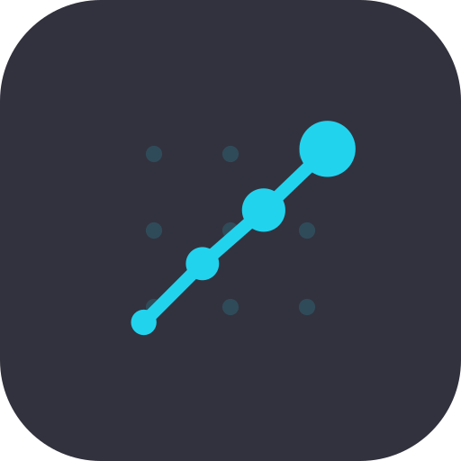
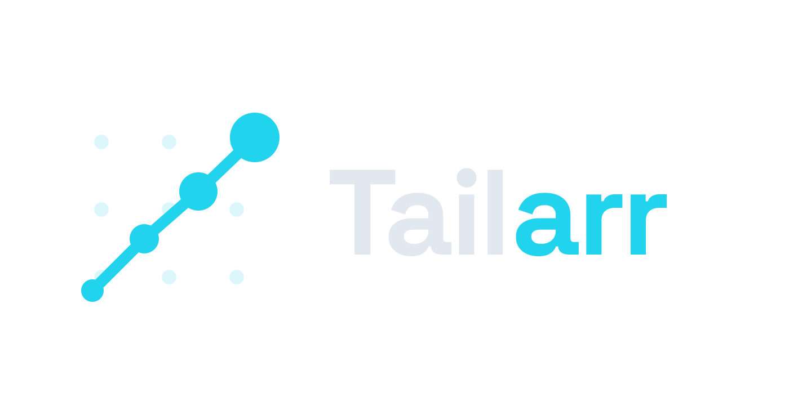

# </img>&nbsp;&nbsp;Tailarr

**The \*arr fleet, running on your tailnet.** One controller for Sonarr, Radarr,
Lidarr, SABnzbd, NZBGet and Tautulli — reachable anywhere, exposed nowhere.

<p align="center">
  
</p>

<p align="center">
  <a href="https://testflight.apple.com/join/m3eyPfSr">
    
  </a>
</p>

Tailarr is a fork of the archived [LunaSea](https://github.com/JagandeepBrar/LunaSea)
project with one defining addition: **an embedded Tailscale node inside the app**.

## Tailscale integration

Tailarr embeds [tsnet](https://tailscale.com/kb/1244/tsnet) (the userspace Tailscale
client) directly in the iOS app via a Go → gomobile xcframework:

- Requests to `*.ts.net` hosts are routed through an in-app HTTP proxy that dials
  peers over your tailnet — **no system-wide VPN profile required**, and the phone's
  VPN slot stays free for anything else.
- The node authenticates **once** with a Tailscale auth key (single-use keys work);
  its identity persists like any other device on your tailnet.
- On every launch and return to foreground, the app verifies the node and its local
  proxy are healthy (iOS reclaims sockets during suspension) and reconnects behind a
  blocking "Connecting to Tailscale…" overlay before any request is sent.
- Toggle lives in **Settings → General → Network → Use Tailscale**.

### Addressing: what routes through the tailnet

When adding a service profile, use one of these host forms:

| Host form | Example | Routed? |
|---|---|---|
| MagicDNS FQDN | `sonarr.tail1234.ts.net` | ✅ |
| Tailscale IPv4 | `100.66.77.18` | ✅ |
| Tailscale IPv6 | `fd7a:115c:a1e0::…` | ✅ |
| MagicDNS short name | `sonarr` | ❌ not yet — the app can't distinguish a tailnet short name from a LAN hostname without querying the node's peer list (planned) |
| LAN / public hosts | `192.168.1.10`, `example.com` | connect directly, bypassing the tailnet (by design) |

Anything not recognized as a Tailscale destination uses the phone's normal
network path, so mixed setups (some services on the tailnet, some local or
public) work without configuration.

Architecture: `lunasea/Go/main.go` (tsnet + HTTP CONNECT proxy) →
`GoLunaSea.xcframework` (gomobile) → Swift MethodChannel bridge
(`ios/Runner/AppDelegate.swift`) → Dart `findProxy` routing
(`lib/system/network/platform/network_io.dart`).

> The generated `GoLunaSea.xcframework` is not committed (92MB+ binaries). Rebuild it
> after cloning:
>
> ```bash
> cd lunasea/Go
> go install golang.org/x/mobile/cmd/gomobile@latest
> gomobile bind -target ios -o GoLunaSea.xcframework .
> rm -rf ../ios/GoLunaSea.xcframework && cp -R GoLunaSea.xcframework ../ios/
> (cd ../ios && pod install)
> ```

## Repository layout

| Directory | Contents |
|---|---|
| `lunasea/` | The Flutter application (iOS, Android, macOS, Windows, Linux, Web) |
| `branding/` | Tailarr brand assets — vector sources, drop-in masters, design brief |
| `lunasea-cloud-functions/` | Firebase Cloud Functions (legacy) |
| `lunasea-notification-service/` | Webhook notification service (legacy) |
| `lunasea-docs/` | Documentation (legacy, pre-fork) |

## Building

```bash
cd lunasea
flutter pub get
npm run generate        # code generation (Hive, Retrofit, i18n)
npm run build:ios       # or build:android / build:macos / ...
```

See `CLAUDE.md` for detailed build notes, iOS signing, and Tailscale gotchas.

## Releases

iOS builds ship to TestFlight via GitHub Actions (`.github/workflows/testflight.yml`)
on version tags (`v*`) or manual dispatch, signed with Apple cloud-managed
certificates through an App Store Connect API key.

## License & attribution

Tailarr is licensed under the [GNU GPL v3.0](./lunasea/LICENSE.md), the same license
as LunaSea. It is a modified fork of LunaSea by Jagandeep Brar and contributors; all
LunaSea copyright notices are preserved. The Tailarr name, logo, and branding are
specific to this fork and are not affiliated with LunaSea or with Tailscale Inc.
Tailscale integration is built on [tailscale.com](https://github.com/tailscale/tailscale)
(BSD-3-Clause).
